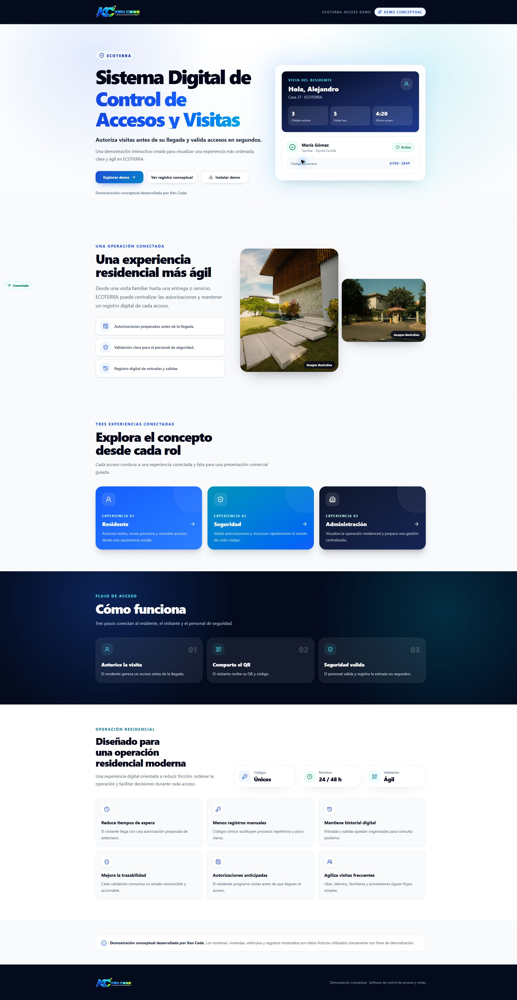
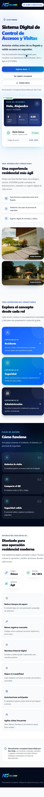
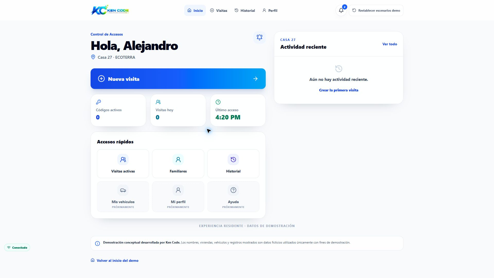
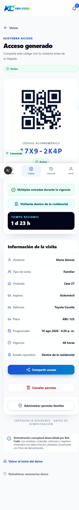
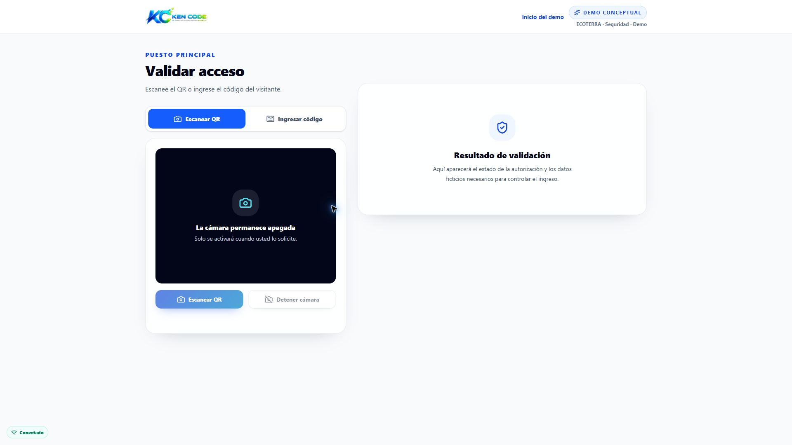
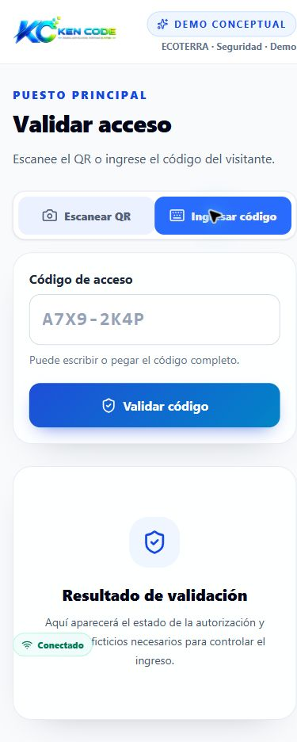
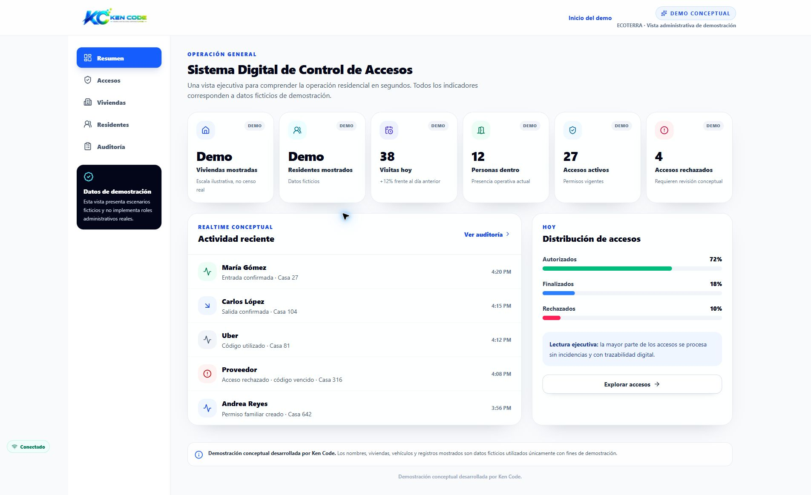
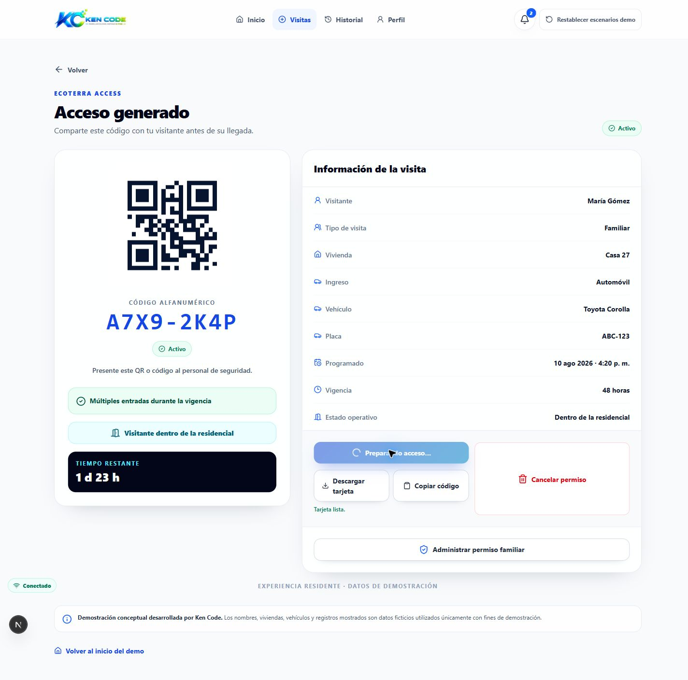

# Auditoría UI/UX — ECOTERRA Access Demo

**Fecha:** 10 de agosto de 2026  
**Producción auditada:** https://kencode-accesos.vercel.app  
**Alcance:** landing, registro, residente, nueva visita, código/QR, permiso familiar, historial, seguridad, administración, estados responsive y experiencia de compartir.  
**Viewports:** 360×800, 390×844, 430×932, 768×1024, 834×1194, 1280×800, 1440×900 y 1920×1080.

## 1. Dictamen general

ECOTERRA Access Demo ya tiene una base visual profesional y vendible. La dirección de arte es coherente, el sistema tipográfico tiene buena jerarquía, la paleta azul/cian/navy transmite tecnología y confianza, y las pantallas transaccionales —especialmente registro, generación de acceso, permiso familiar e historial— superan claramente el nivel de un prototipo básico.

El dictamen no es “rediseñar todo”. El producto ya puede presentarse con confianza en una demostración guiada. Sin embargo, todavía no alcanza de forma uniforme el nivel de un SaaS premium listo para una presentación desatendida: la vista de Seguridad se siente demasiado vacía en desktop, el dashboard de residente en producción aparece sin actividad, la composición fotográfica de la landing pierde balance en desktop y el indicador persistente **“Conectado”** reduce la calidad visual y llega a tapar contenido.

La landing no está globalmente vacía. El hero es fuerte incluso en 1920×1080. La sensación de simplicidad aparece en secciones posteriores y en algunas pantallas operativas que no aprovechan el ancho disponible. Con una intervención concentrada en 5–7 puntos, la demo puede subir notablemente su percepción de valor sin añadir ruido.

**Respuesta directa:** sí se ve suficientemente premium para una presentación comercial guiada; todavía necesita pulido antes de considerarla una experiencia premium completamente cerrada.

## 2. Lo que está bien

- **Hero principal:** título potente, contraste alto, propuesta entendible en segundos y mockup de producto creíble. En desktop mantiene buen peso visual y no depende de decoración excesiva.
- **Sistema visual:** azul, cian, navy, blanco y grises están usados con consistencia. Las superficies, radios, sombras y bordes comparten lenguaje.
- **Jerarquía:** títulos, subtítulos, estados y CTAs se reconocen rápido. “Nueva visita”, “Generar acceso” y “Validar código” tienen protagonismo correcto.
- **QR y código:** en `/demo/residente/codigo` el QR es el foco correcto, el código alfanumérico es legible y el estado operativo no compite con ellos.
- **Registro conceptual:** es una de las pantallas más sólidas. El panel narrativo, el formulario y la advertencia conceptual forman una composición convincente en desktop.
- **Nueva visita:** la selección por tipo, el formulario y la vigencia están bien agrupados. La densidad es adecuada y los controles son claros.
- **Permiso familiar:** tiene buena estructura, buena lectura de estado, métricas simples y un balance correcto entre detalle y QR.
- **Historial:** filtros, indicadores y tarjetas comunican control y trazabilidad. Es una pantalla funcional con estética de producto real.
- **Administración:** es la vista con mayor percepción de SaaS. La navegación lateral, los KPIs, la actividad y la distribución de accesos construyen bien el valor ejecutivo.
- **Responsive:** no se detectó desbordamiento horizontal en las 48 combinaciones internas medidas ni en los ocho tamaños de landing.
- **Accesibilidad visual:** foco visible global de 3 px en cian, targets táctiles de al menos 44 px y estados de color acompañados por texto/icono.
- **Interacciones:** los hover y active son sutiles; elevan botones y tarjetas sin volver la interfaz llamativa de más.
- **Tarjeta compartible (implementación):** el formato 1080×1350, QR de 500 px, código grande y bloque de detalles es una base correcta para compartir por mensajería.

## 3. Problemas encontrados

1. **“Conectado” es el problema transversal más claro.** En móvil se superpone al QR, estados, contenido de Seguridad, actividad administrativa y navegación inferior. En desktop queda aislado en la esquina izquierda y parece un indicador de depuración o una utilidad técnica, no un elemento premium.
2. **Seguridad es la pantalla más débil en desktop.** El escáner ocupa una columna y el estado vacío de resultado ocupa otra, pero queda una gran cantidad de espacio sin función. A 1920×1080 se percibe como una demo incompleta.
3. **El dashboard de residente en producción está vacío.** Muestra 0 códigos, 0 visitas y “Aún no hay actividad reciente”. Aunque el estado vacío es correcto, comercialmente contradice la landing, que presenta actividad y métricas. En 1440/1920 el vacío reduce mucho la fuerza de la pantalla.
4. **La pareja de imágenes de la landing está desbalanceada en desktop/tablet.** A 1920 la imagen principal mide aproximadamente 363×454 y la secundaria 309×232; en 834 ocurre un patrón similar, 410×512 frente a 349×262. La diferencia no tiene una narrativa suficientemente clara y la segunda imagen parece accesoria.
5. **Las dos fotografías no transmiten exactamente el mismo nivel aspiracional.** La residencia contemporánea se siente premium; la imagen del acceso se ve más documental y antigua. Esto baja la consistencia de marca.
6. **Las secciones inferiores de landing repiten el patrón “título + tarjetas”.** Roles, flujo y beneficios son claras, pero la progresión pierde sorpresa y se siente más informativa que comercial.
7. **Administración repite demasiado la etiqueta “Demo”.** Dos KPIs muestran literalmente “Demo” como valor y cada tarjeta tiene otra etiqueta “DEMO”. Sumado a los avisos superior/lateral/inferior, la cautela conceptual domina sobre el contenido.
8. **Header de residente apretado en 768 px.** La navegación permanece en modo desktop y “Restablecer escenarios demo” se parte en tres líneas. Funciona, pero no se ve refinado.
9. **Navegación administrativa móvil poco descubrible.** El carrusel horizontal evita overflow de página, pero el último ítem puede quedar cortado sin una señal visual clara de que se puede deslizar.
10. **Estado de compartir en desktop desbalanceado.** Cuando aparecen “Descargar tarjeta” y “Copiar código”, el botón hermano de cancelar puede estirarse verticalmente por el grid. Durante la preparación también pueden coexistir “Preparando acceso…” y “Tarjeta lista”, generando ambigüedad.
11. **Exceso de disclaimers repetidos.** “Demo conceptual”, “datos ficticios” y mensajes equivalentes aparecen en varias capas. Son necesarios, pero su repetición resta inmersión y hace que el producto se venda menos a sí mismo.

## 4. Oportunidades de mejora

- Eliminar el estado online persistente y mostrar únicamente un aviso contextual cuando exista pérdida de conexión.
- Rediseñar parcialmente el estado inicial de Seguridad: dar más protagonismo a la acción, mostrar una guía breve del flujo y convertir el panel derecho en una vista de resultado/previsualización operativa, no en una tarjeta vacía sobredimensionada.
- Preparar un estado de demostración poblado y consistente antes de cada presentación, sin obligar al cliente a imaginar el valor desde ceros.
- Replantear la composición fotográfica como un módulo editorial intencional: imagen principal + secundaria anclada, alturas más relacionadas, misma gradación y una justificación visual clara.
- Introducir uno o dos cambios de ritmo en landing: un bloque de producto más visual, un fondo con textura/retícula muy sutil o una composición conectada del flujo. No aplicar fondos decorativos a todas las secciones.
- Reducir la repetición de “Demo” en administración y concentrar el aviso conceptual en un punto visible pero discreto.
- Cambiar antes el breakpoint del header residente o simplificar el botón de restablecimiento en tablet.
- Hacer que el fallback de compartir ocupe una fila propia o alinee los botones al inicio para que ninguna acción destructiva se estire.
- Mantener el mismo sistema de cards, radios, sombras y botones: ya funciona y no necesita una sustitución global.

Los cambios de mayor impacto serían:

1. Eliminar “Conectado”.
2. Fortalecer Seguridad en desktop.
3. Garantizar un estado de demo poblado y coherente en producción.
4. Corregir la composición fotográfica de landing.
5. Refinar el header residente en tablet.
6. Simplificar el lenguaje “Demo” de administración.
7. Corregir el layout del fallback de compartir.

## 5. Revisión específica por pantalla

### `/`

Hero fuerte, claro y comercial. El mockup de residente funciona mejor que una imagen genérica. La sección fotográfica aporta contexto residencial, pero necesita una composición más intencional. “Explora el concepto”, “Cómo funciona” y “Operación residencial” son coherentes, aunque usan una cadencia demasiado similar. No requiere rediseño total; sí una mejora editorial en imágenes y ritmo.

### `/demo/registro`

Pantalla sólida y convincente. El panel de tres pasos equilibra el formulario y evita que el desktop se vea vacío. Los campos y avisos tienen jerarquía clara. Solo conviene vigilar la longitud vertical en móvil y reducir disclaimers duplicados; no necesita cambios estructurales.

### `/demo/residente`

El CTA y los accesos rápidos están bien. Con datos poblados, la actividad reciente completa el dashboard y la pantalla se siente de producto. En la producción auditada está vacía; por eso el lado derecho y la mitad inferior pierden fuerza. La prioridad aquí es de preparación de demo/estado, no un rediseño completo.

### `/demo/residente/nueva-visita`

Buena composición en desktop: selección a la izquierda y formulario a la derecha. Los controles de tipo de visita y vigencia son entendibles y visualmente agradables. En tablet la pantalla se vuelve larga y el header está apretado, pero no hay overflow. Mantener estructura y pulir responsive.

### `/demo/residente/codigo`

Una de las pantallas más fuertes. El QR y el código dominan correctamente; los detalles están ordenados y las acciones son claras. En móvil la lectura sigue siendo buena. Deben corregirse la superposición de “Conectado” y el comportamiento visual del fallback de compartir.

### `/demo/residente/permiso-familiar`

Se siente premium y funcional. Estado, datos, QR, tiempo restante y conteos están bien agrupados. El layout desktop aprovecha correctamente las dos columnas. No requiere rediseño parcial; solo el mismo ajuste transversal de conectividad/header y compartir.

### `/demo/residente/historial`

Buen nivel de producto: indicadores, filtros y cards hacen que el sistema parezca real y operativo. En móvil la longitud es inevitable, pero la lectura se conserva. Puede mejorarse la densidad del filtro por fecha, pero es una prioridad baja.

### `/demo/seguridad`

Necesita rediseño parcial. El flujo es claro y la alternativa de código manual está bien resuelta, pero el estado inicial en desktop se siente vacío y poco demostrativo. En móvil funciona mejor porque las dos tarjetas se apilan y ocupan el viewport de manera natural. La pantalla debe comunicar más control operativo sin añadir información inventada.

### `/demo/admin`

Es la vista que mejor justifica valor comercial. Se percibe como dashboard SaaS, especialmente en 1440/1920. En móvil la adaptación a tarjetas funciona. Deben reducirse las etiquetas “Demo”, mejorar la navegación horizontal móvil y evitar valores cuyo contenido sea únicamente “Demo”.

## 6. Revisión específica de desktop

**Fuertes:** hero, registro, nueva visita, código/QR, permiso familiar, historial poblado y administración. El max-width de contenido mantiene líneas legibles y márgenes elegantes incluso en 1920.

**Débiles:** Seguridad y el dashboard residente vacío. En ambos casos el problema no es simplemente “mucho blanco”; es falta de información visual útil en el área disponible. Agregar decoración sin contenido no resolvería el problema.

**Landing:** no se ve demasiado simple en el hero. Sí se siente más plana después de la sección de roles, porque el patrón de tarjetas se repite. Conviene reforzar selectivamente el flujo o la sección operacional con un fondo o una composición visual diferenciada.

**Tablet 768:** el header del residente es el punto responsive menos refinado. El botón de restablecimiento se parte y compite con cuatro enlaces, notificaciones y logo.

## 7. Revisión específica de imágenes y composición

Las imágenes actuales sí tienen sentido: contextualizan la residencial y el acceso. No están mal dimensionadas en móvil, donde ambas ocupan el ancho y la secuencia se entiende.

En desktop/tablet, la diferencia de alturas es excesiva para una pareja que parece representar dos partes equivalentes de la solución. La imagen secundaria queda aproximadamente a la mitad de la altura de la principal. Esto confirma la percepción inicial de desbalance.

Recomendación:

- Mantener una imagen hero residencial principal.
- Dar a la imagen de acceso una altura de 65–75% de la principal o integrarla como tarjeta superpuesta con una alineación deliberada.
- Unificar color, contraste y temperatura de ambas fotografías.
- Considerar reemplazar la segunda imagen por un acceso residencial más contemporáneo si existe un recurso auténtico o autorizado de mejor nivel.
- Evitar usar imágenes como simple relleno. El módulo actual necesita composición, no más cantidad.

La tarjeta compartible tiene buenas proporciones técnicas: 1080×1350, QR dominante y código de alta legibilidad. Se revisó su implementación y el estado de fallback. El navegador de auditoría no permitió abrir directamente el `blob:` generado como una imagen aislada, por lo que no se adjunta un PNG independiente de esa tarjeta.

## 8. Revisión específica del indicador “Conectado”

**Sí, debe eliminarse por completo en su estado online.**

No aporta información comercial: el usuario asume que la aplicación está conectada mientras funciona. Visualmente parece un indicador técnico, ocupa una posición ajena al sistema de navegación y en móvil tapa contenido real. También reduce la calidad de las capturas y de la presentación guiada.

La necesidad funcional de conectividad puede conservarse así:

- No mostrar nada cuando hay conexión.
- Mostrar solo **“Sin conexión”** cuando ocurra el problema.
- Usar un banner/toast contextual, accesible y no superpuesto a la navegación.
- Mantener el anuncio para lectores de pantalla sin convertirlo en un pill permanente.

## 9. Prioridad de cambios

### Alta prioridad

- Eliminar “Conectado” y conservar únicamente el estado offline contextual.
- Fortalecer el estado inicial de Seguridad en desktop.
- Garantizar una presentación con datos demo poblados y coherentes.
- Corregir la composición y consistencia de las dos imágenes de landing.
- Corregir el layout/estado visual del fallback de compartir.

### Media prioridad

- Simplificar el header residente en 768–900 px.
- Diferenciar visualmente una sección inferior de landing para romper la repetición.
- Reducir el exceso de etiquetas y disclaimers “Demo”.
- Añadir una señal de scroll/gradiente a la navegación administrativa móvil.
- Refinar el vacío de actividad del residente para que siga comunicando valor.

### Baja prioridad

- Ajustar microespaciados de filtros y cards secundarias.
- Unificar aún más la temperatura/edición de fotografías.
- Revisar copy menor para reducir repeticiones de “conceptual”.
- Pulir el feedback temporal de “Preparando acceso…” frente a “Tarjeta lista”.

## 10. Plan de mejora recomendado

### Fase A: quick wins

- Retirar “Conectado”.
- Ajustar breakpoint/header de residente en tablet.
- Corregir el grid del fallback de compartir.
- Reducir etiquetas “Demo” repetidas.
- Preparar una checklist de presentación con datos demo listos.

### Fase B: mejoras visuales fuertes

- Rediseñar parcialmente Seguridad para aprovechar desktop.
- Rehacer la composición fotográfica de landing y, si es necesario, sustituir la imagen secundaria.
- Dar un cambio de ritmo visual a una sección inferior de landing mediante fondo, retícula sutil o composición de producto.
- Mejorar el estado vacío del residente sin inflarlo con contenido decorativo.

### Fase C: pulido final

- Validar hover, focus, loading, empty, error y offline en todas las rutas.
- Revisar consistencia final de paddings, alturas, sombras y microcopy.
- Repetir capturas en los ocho viewports.
- Revisar la tarjeta compartible final en WhatsApp/iOS/Android y confirmar legibilidad real.
- Ejecutar una presentación comercial completa de punta a punta.

## 11. Capturas

Las capturas completas están en [`docs/audit/`](audit/). También se guardó [`responsive-metrics.json`](audit/responsive-metrics.json) con la matriz de medición.

Las rutas con datos poblados se capturaron en un entorno local aislado para no modificar Firebase. El pequeño icono circular negro “N” que aparece en esas capturas pertenece al overlay de desarrollo de Next.js; no forma parte del producto ni aparece en producción.

### Landing desktop 1920×1080

Muestra un hero sólido y el desbalance entre imagen principal y secundaria.

### Landing móvil 390×844

Confirma buena secuencia y ausencia de overflow; también muestra cómo el indicador invade el contenido.

### Residente desktop 1920×1080 — producción

Evidencia el riesgo comercial del estado vacío actual.

### Código móvil 390×844 — datos locales ficticios

Confirma la buena prioridad del QR y la superposición de elementos fijos.

### Seguridad desktop 1920×1080

Evidencia el espacio sin función y la debilidad del estado inicial.

### Seguridad manual móvil 390×844

Muestra que el flujo alternativo por código es claro, pero “Conectado” tapa el texto del resultado.

### Administración desktop 1920×1080

Muestra la pantalla con mayor percepción SaaS y la repetición de etiquetas “Demo”.

### Estado de compartir en desktop

Muestra los fallbacks y el desbalance vertical de la fila de acciones.

## 12. Esperar aprobación

No se realizaron cambios de diseño, código, Firebase, variables de entorno, Git ni despliegue. Los únicos archivos creados son este informe y la evidencia de auditoría en `docs/audit/`.

La auditoría queda lista para revisión. Se espera aprobación antes de implementar cualquiera de las mejoras recomendadas.
